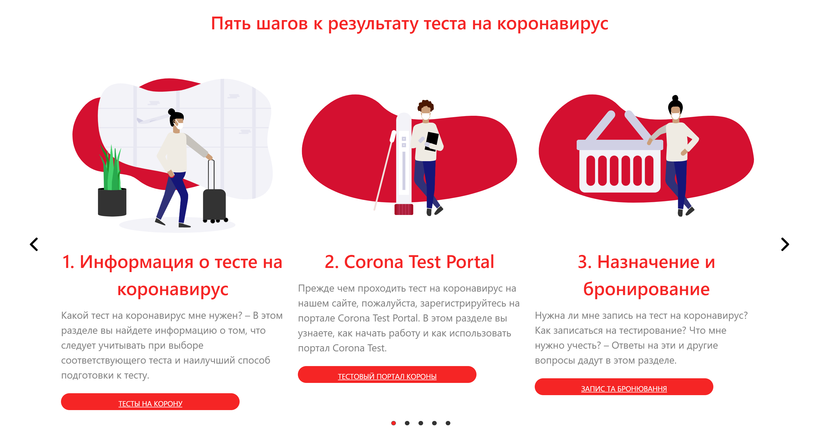

# Simple_site

Проект включає у себе створення простого відзивчевого тексту у максимально короткі терміни беручи дизайн із різних інтернет ресурсів та сайтів (на проект було потрачено 5 годин загального часту)

### Дизайн

Усі фотографії взяті із інтернету та різних сайтів, деякі обробдені у фотошопі під потрібний дизайн, складання основного дизайну було моєю задачею і дизайн створювався під час виконання завдання

Сайт виконаний у червоно-білих тонах та із сірою шапкою(по прозьбі замовника)

### Особливості

На сайті присутній слайдер який автоматично пролистується та знизу вказана поточна позиція, також є стрілочки які позволяєють гортати слайди. Слайдер зроблений за допомогою бібліотеки slick.js та фреймворку bootstrap

### Адаптив

Сайт є частково відзивчивим, тому що на адаптив не було часу, і сайт верстався переважно в %

